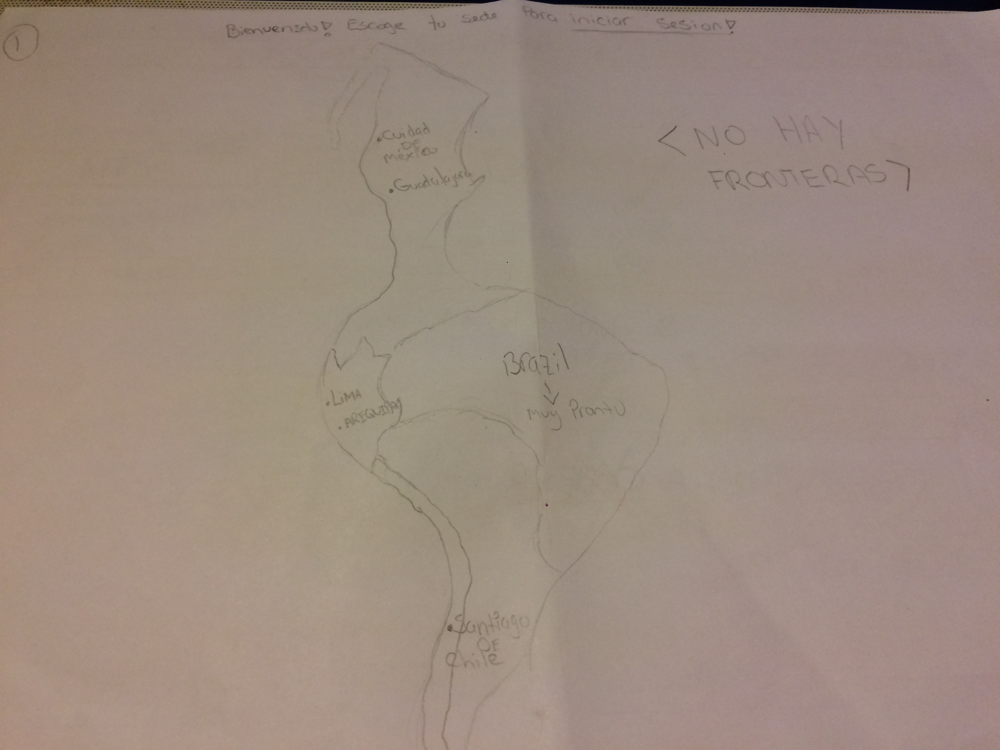
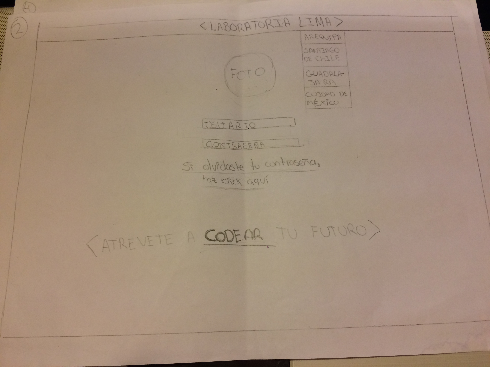
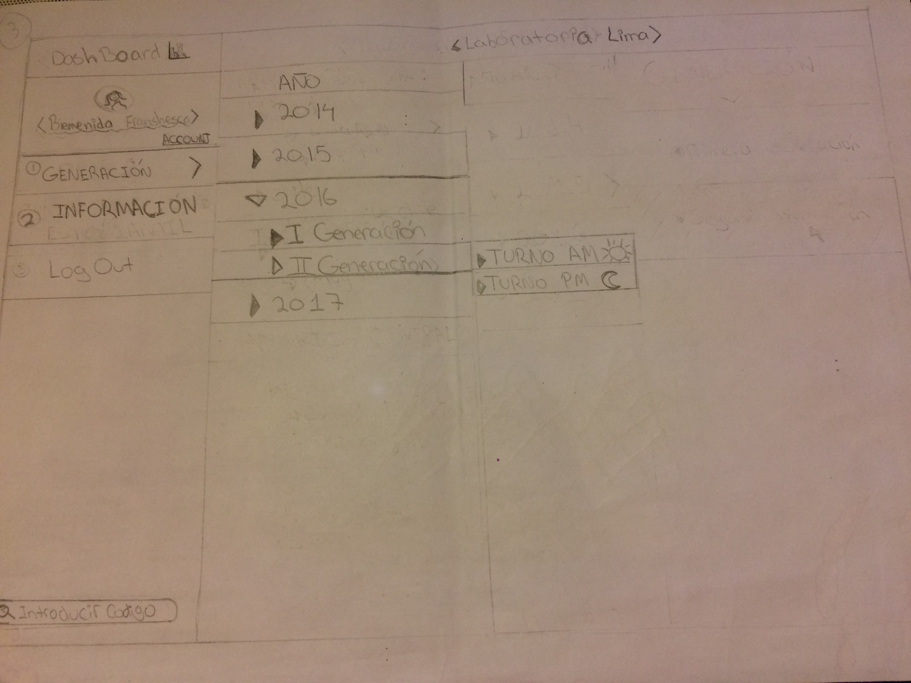
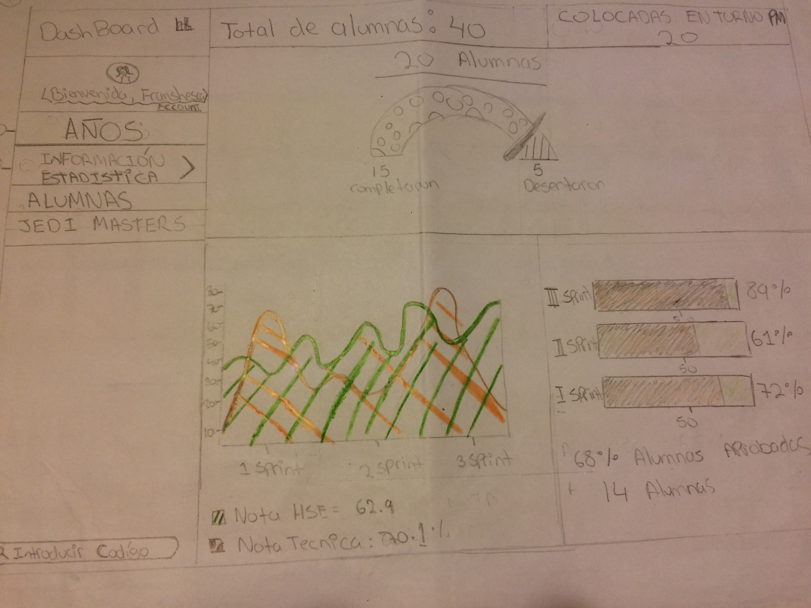

# UX Desing: Sketch

En este reto estamos realizando un sketch sobre la información de alumnas de Laboratoria.

1. Primero, hemos realizado un mapa de America y señalado en la localización exacta en donde se encuentran las sedes de Labororatia. Sí hacemos _"click"_ en **Lima**, el sistema solo nos dara la información de la estudiantes y profesores de **esa** sede

2. Despues de escoger la sede, nos rebotará a la página de entrada donde el usuarío tendría que ingresar su codigo junto con la contraseña para poder visualizar los datos estudiantiles. En caso de que hallamos escogido una sede erronea, para no regresar al _inicio_ (al mapa), nos ubicamos en la parte superior donde nos índica **LABORATORIA LIMA**, le hacemos _"click"_ y nos aparecere todas las sedes. En caso de que nos olvidemos de la contraseña, he creado la opción en la parte baja de la página, para que nos lo reenvie a nuestro correo personal.

3. En este siguiente paso, nos encontramos en la opción **"Generación"** donde nos mostrara el año desde que  *Laboratoria* se inició. En este simulacro, nos hemos situado en el año 2016, el cual nos rebota la opción de la _I y II generación_ y por último, el turno del cual queremos la data. Sin embargo, si tenemos la información de una estudiante en especifico, podemos filtrarlo por su código personal, en la parte baja izquierda.

4. Al haber terminado de escoger la generación, grupo y turno, nos encontraremos en *Información estadística*, cual nos dará una información de data general de las estudiantes de **SOLO** ese turno; Sí queremos información mas personalizada de las estudiantes o profesoras, nos ubicamos en la opción _alumnas_/_Jedi master_, la cual aparece cuando escogemos: *Información estadística*. Ambas opciones, tendran fotos de las de cada uno del personal de ese sprint y al hacerles **click** a la foto, nos dara la información personalizada.

> Tercer reto de código realizado por Franshesca Quezada.
